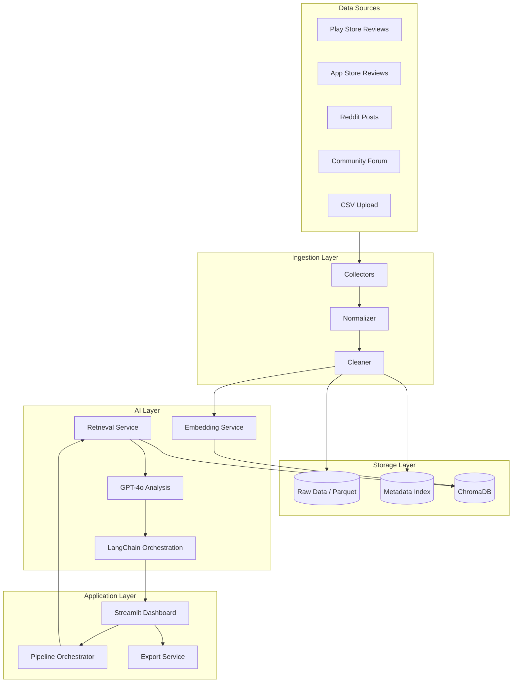
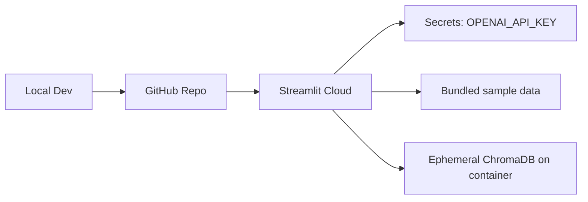

# System Architecture

## Overview

The Spotify Review Discovery Engine is a batch-oriented analytics application that ingests unstructured user feedback, stores it in a searchable vector index, and uses retrieval-augmented generation (RAG) to produce structured product insights surfaced through a Streamlit dashboard.



## Design Principles

1. **Modular pipelines** — Each stage (collect, clean, embed, analyze) is independently testable.
2. **Grounded insights** — Every AI output must cite retrieved review chunks, not free-form speculation.
3. **Idempotent ingestion** — Re-running the pipeline on the same data does not duplicate records.
4. **Local-first development** — ChromaDB and sample datasets enable full offline development except for OpenAI calls.
5. **Progressive enhancement** — Ship with CSV upload and one live source first; add collectors incrementally.

## Component Architecture

### 1. Data Ingestion Layer

Responsible for acquiring raw feedback and producing a unified schema.

| Component | Responsibility |
|-----------|----------------|
| `CSVUploader` | Accept user-uploaded review files with schema validation |
| `PlayStoreCollector` | Fetch or parse Google Play reviews (scraper or export file) |
| `AppStoreCollector` | Load sample dataset or parse App Store export |
| `RedditCollector` | Pull posts/comments via PRAW from target subreddits |
| `ForumCollector` | Scrape or load cached Spotify Community Forum posts |
| `Normalizer` | Map all sources to a canonical `ReviewRecord` schema |
| `Cleaner` | Deduplicate, strip HTML, filter spam, normalize dates/ratings |

**Canonical schema (`ReviewRecord`)**

```python
ReviewRecord:
  id: str              # stable hash of source + external_id
  source: str          # play_store | app_store | reddit | forum | csv
  text: str            # review body or post content
  title: str | None    # post title (Reddit/forum)
  rating: int | None   # 1–5 stars (store reviews)
  author: str | None
  created_at: datetime
  url: str | None
  metadata: dict       # subreddit, app_version, platform, etc.
```

### 2. Storage Layer

| Store | Purpose | Format |
|-------|---------|--------|
| Raw store | Persist cleaned records for reprocessing | Parquet or JSONL in `data/processed/` |
| ChromaDB | Semantic search index | Persistent collection per dataset run |
| Insight cache | Store generated analysis to avoid re-calling LLM | JSON in `data/insights/` |

**ChromaDB collection design**

- **Collection name:** `spotify_reviews_{dataset_id}`
- **Document:** cleaned review text (title + body concatenated)
- **Metadata:** `source`, `rating`, `created_at`, `segment_hint`, `sentiment_label`
- **Embedding model:** `all-MiniLM-L6-v2` (Sentence Transformers) — fast, good quality for short text

### 3. Embedding & Retrieval Layer

| Component | Responsibility |
|-----------|----------------|
| `EmbeddingService` | Batch-encode review texts; cache embeddings on disk |
| `VectorStoreManager` | Create, upsert, query, and delete ChromaDB collections |
| `RetrievalService` | Semantic search with optional metadata filters (source, rating, date range) |
| `Reranker` (optional) | Re-score top-k results for query relevance |

**Retrieval strategy**

- Default `top_k=20` for analysis queries; `top_k=5` for dashboard Q&A
- Metadata pre-filtering when user selects a source or date range
- Chunking: reviews under 512 tokens stored as single documents; longer forum posts split by paragraph with overlap

### 4. AI Analysis Layer

Built on LangChain with GPT-4o as the reasoning engine.

| Component | Responsibility |
|-----------|----------------|
| `SentimentAnalyzer` | Classify positive / neutral / negative per review |
| `ThemeExtractor` | Cluster and label recurring themes via LLM + retrieval |
| `SegmentClassifier` | Assign reviews to user segments (see below) |
| `OpportunityDetector` | Identify high-frequency unmet needs with business framing |
| `InsightGenerator` | Produce structured insight objects per problem statement format |
| `QAService` | Answer natural-language questions with cited quotes |

**User segments**

| Segment | Signals |
|---------|---------|
| Playlist Loyalists | Repeated playlist use, frustration with shuffle/repeat |
| Passive Listeners | Background listening, autoplay, minimal search behavior |
| Active Explorers | Search-heavy, discovery feature mentions, new artist requests |
| Mood-Based Listeners | Mood/activity context, radio/station preferences |

**Insight output schema**

```python
Insight:
  theme: str
  frequency: int | float      # count or percentage
  representative_quotes: list[str]
  business_impact: str
  product_opportunity: str
  sources: list[str]
  segment: str | None
```

**Prompt design guidelines**

- System prompt enforces JSON output and requires quote citations from retrieved context
- Temperature 0.2 for classification; 0.4 for summary generation
- Batch reviews in groups of 15–20 for theme extraction to manage token limits

### 5. Application Layer (Streamlit)

| Page / Section | Backend services used |
|----------------|----------------------|
| Home / Upload | `CSVUploader`, pipeline trigger |
| Review Overview | `SentimentAnalyzer`, aggregate stats |
| Top Pain Points | `ThemeExtractor`, frequency ranking |
| Discovery Challenges | filtered theme retrieval + LLM |
| User Segments | `SegmentClassifier`, segment distribution charts |
| Opportunity Areas | `OpportunityDetector` |
| Ask Reviews (search) | `QAService`, `RetrievalService` |
| Export | `ExportService` (CSV + PDF) |

**Session state**

- `dataset_id` — active dataset identifier
- `pipeline_status` — idle | running | complete | error
- `insights_cache` — loaded insight JSON for dashboard rendering

### 6. Export Layer

| Format | Contents |
|--------|----------|
| CSV | Flat table of insights (theme, frequency, impact, opportunity, quotes) |
| PDF | Executive summary + section breakdowns + top quotes |

Uses `reportlab` or `fpdf2` for PDF generation.

## Data Flow

### Ingestion flow

```
Source raw data
  → validate schema
  → normalize to ReviewRecord
  → deduplicate by id
  → write to data/processed/{dataset_id}.parquet
  → trigger embedding job
```

### Analysis flow

```
Load processed dataset
  → embed & upsert to ChromaDB
  → run sentiment pass (batched)
  → retrieve clusters for theme extraction
  → LLM generates Insight objects
  → cache to data/insights/{dataset_id}.json
  → dashboard reads cache + live Q&A queries
```

### Q&A flow

```
User question
  → embed query
  → retrieve top-k similar reviews
  → build prompt with retrieved context
  → GPT-4o generates answer with citations
  → render in Streamlit with source links
```

## Technology Decisions

| Decision | Choice | Rationale |
|----------|--------|-----------|
| Vector DB | ChromaDB | Lightweight, persistent, no separate server for MVP |
| Embeddings | Sentence Transformers (local) | No extra API cost; sufficient for review-length text |
| LLM | GPT-4o | Strong reasoning and structured JSON output |
| Orchestration | LangChain | Chains, retrievers, and prompt templates out of the box |
| Frontend | Streamlit | Fast to build interactive dashboards; Streamlit Cloud deployment |
| Raw storage | Parquet | Efficient columnar storage for analytics with Pandas |

## Security & Configuration

| Concern | Approach |
|---------|----------|
| API keys | `.env` file; never committed; loaded via `python-dotenv` |
| Secrets in Streamlit Cloud | Platform secrets manager |
| PII | Strip emails/phone patterns in cleaner; do not log raw author names in exports |
| Rate limits | Exponential backoff on OpenAI and Reddit API calls |

**Required environment variables**

```
OPENAI_API_KEY=
REDDIT_CLIENT_ID=          # optional, for live Reddit ingestion
REDDIT_CLIENT_SECRET=
REDDIT_USER_AGENT=
CHROMA_PERSIST_DIR=./data/chroma
DATA_DIR=./data
EMBEDDING_MODEL=all-MiniLM-L6-v2
```

## Deployment Architecture



**Streamlit Cloud considerations**

- Bundle sample datasets in `data/sample/` for demo without upload
- Persist ChromaDB to `./data/chroma` within session; re-index on upload
- Pin dependencies in `requirements.txt`
- Set `OPENAI_API_KEY` in Streamlit secrets.toml

## Non-Functional Requirements

| Requirement | Target |
|-------------|--------|
| Pipeline throughput | 1,000 reviews indexed in < 2 minutes (local, CPU embeddings) |
| Q&A latency | < 5 seconds per query (excluding cold start) |
| Dashboard load | < 3 seconds with cached insights |
| Test coverage | Core pipeline and schema validation unit tested |

## Future Extensions (Post-MVP)

- Scheduled ingestion via cron or GitHub Actions
- Multi-dataset comparison over time
- Fine-tuned segment classifier
- Weights & Biases or LangSmith tracing for prompt evaluation
- Replace ChromaDB with Pinecone/Qdrant for production scale
