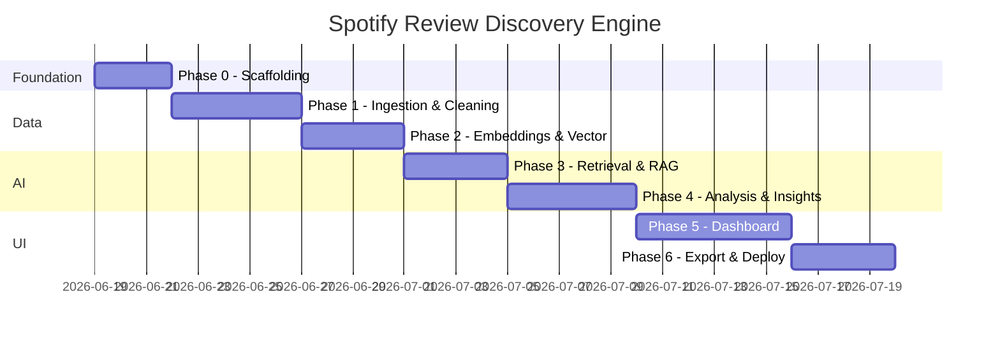
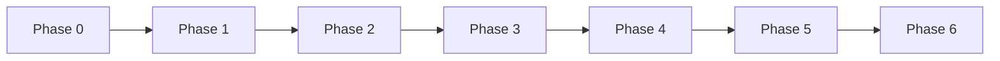

# Phase-Wise Implementation Plan

## Timeline Overview



**Estimated total:** 24–31 working days

---

## Phase 0: Foundation & Scaffolding

**Goal:** Establish project structure, dependencies, configuration, and a runnable skeleton.

**Duration:** 2–3 days

### Tasks

| # | Task | Output |
|---|------|--------|
| 0.1 | Initialize repository structure (see [project-structure.md](./project-structure.md)) | Folder tree, `__init__.py` files |
| 0.2 | Create `requirements.txt` with pinned versions | Python dependencies |
| 0.3 | Add `.env.example`, `config/settings.py` | Centralized configuration |
| 0.4 | Set up logging (`config/logging.py`) | Structured console logs |
| 0.5 | Define `ReviewRecord` and `Insight` Pydantic models | `src/models/schemas.py` |
| 0.6 | Create minimal Streamlit app entry point | `app/main.py` runs locally |
| 0.7 | Add sample review CSV (50–100 rows) | `data/sample/play_store_sample.csv` |
| 0.8 | Write initial README with setup steps | Root `README.md` |

### Deliverables

- [ ] `streamlit run app/main.py` launches empty dashboard
- [ ] Config loads from environment without errors
- [ ] Sample data file present and documented

### Exit criteria

Project boots locally with one command; team agrees on module boundaries.

---

## Phase 1: Data Ingestion & Cleaning

**Goal:** Ingest feedback from CSV upload and at least one external source; produce clean, normalized datasets.

**Duration:** 4–5 days

**Depends on:** Phase 0

### Tasks

| # | Task | Output |
|---|------|--------|
| 1.1 | Implement `CSVUploader` with schema validation | `src/ingestion/csv_loader.py` |
| 1.2 | Build `Normalizer` for canonical `ReviewRecord` mapping | `src/ingestion/normalizer.py` |
| 1.3 | Build `Cleaner` (dedup, HTML strip, date parse, spam filter) | `src/ingestion/cleaner.py` |
| 1.4 | Implement Play Store parser (CSV/JSON export format) | `src/ingestion/play_store.py` |
| 1.5 | Add App Store sample dataset loader | `src/ingestion/app_store.py` + sample file |
| 1.6 | Implement Reddit collector via PRAW (optional toggle) | `src/ingestion/reddit.py` |
| 1.7 | Add forum scraper stub or cached JSON loader | `src/ingestion/forum.py` |
| 1.8 | Persist cleaned data to Parquet | `src/storage/raw_store.py` |
| 1.9 | Unit tests for normalizer and cleaner | `tests/test_ingestion.py` |

### Data cleaning rules

- Drop reviews with fewer than 10 characters
- Deduplicate on `hash(source + text + created_at)`
- Normalize ratings to 1–5 integer or `None`
- Parse dates to UTC ISO format
- Remove URLs-only or emoji-only noise posts

### Deliverables

- [ ] Upload CSV → cleaned Parquet written to `data/processed/`
- [ ] At least Play Store + sample App Store data load successfully
- [ ] Ingestion summary stats logged (total, dropped, deduplicated)

### Exit criteria

Pipeline stage 1 runs end-to-end on sample data; processed record count matches expectations.

---

## Phase 2: Embeddings & Vector Store

**Goal:** Generate embeddings and persist searchable vectors in ChromaDB.

**Duration:** 3–4 days

**Depends on:** Phase 1

### Tasks

| # | Task | Output |
|---|------|--------|
| 2.1 | Implement `EmbeddingService` with Sentence Transformers | `src/embeddings/embedding_service.py` |
| 2.2 | Add batch encoding with progress logging | Batch size 64, tqdm progress |
| 2.3 | Implement `VectorStoreManager` (create, upsert, query, delete) | `src/storage/vector_store.py` |
| 2.4 | Wire ingestion output → embedding → ChromaDB upsert | `src/pipeline/embed_pipeline.py` |
| 2.5 | Add embedding cache to avoid re-encoding unchanged records | `data/embeddings/` cache dir |
| 2.6 | Implement collection lifecycle (one collection per dataset) | `spotify_reviews_{dataset_id}` |
| 2.7 | Unit tests for vector store CRUD and similarity search | `tests/test_vector_store.py` |

### Deliverables

- [ ] 1,000 reviews embedded and searchable in < 2 minutes (local CPU)
- [ ] Semantic search returns relevant results for test queries ("bad recommendations", "discover new music")
- [ ] Re-running pipeline is idempotent (no duplicate vectors)

### Exit criteria

`RetrievalService.similarity_search("recommendation algorithm")` returns grounded review snippets.

---

## Phase 3: Retrieval & RAG Layer

**Goal:** Build retrieval-augmented Q&A that answers questions with cited review evidence.

**Duration:** 3–4 days

**Depends on:** Phase 2

### Tasks

| # | Task | Output |
|---|------|--------|
| 3.1 | Implement `RetrievalService` with metadata filters | `src/retrieval/retrieval_service.py` |
| 3.2 | Add chunking strategy for long forum/Reddit posts | `src/retrieval/chunker.py` |
| 3.3 | Create LangChain retriever wrapper over ChromaDB | `src/retrieval/chroma_retriever.py` |
| 3.4 | Build Q&A prompt template with citation requirements | `src/ai/prompts/qa_prompt.py` |
| 3.5 | Implement `QAService` using GPT-4o | `src/ai/qa_service.py` |
| 3.6 | Add source attribution formatting (quote + source + date) | Response schema |
| 3.7 | Integration test: 5 canonical questions from problem statement | `tests/test_qa_service.py` |

### Canonical test questions

1. "Why do users struggle to discover new music?"
2. "What frustrates users most about recommendations?"
3. "What causes repetitive listening behavior?"
4. "How do different user types describe their discovery experience?"
5. "What features do users wish Spotify had?"

### Deliverables

- [ ] Q&A returns answers with 2–3 cited quotes per response
- [ ] Metadata filters (source, rating) work in retrieval
- [ ] Prompt resists hallucination when context is empty (returns "insufficient data")

### Exit criteria

All five test questions produce grounded, cite-backed answers on sample dataset.

---

## Phase 4: AI Analysis & Insight Generation

**Goal:** Generate structured insights for dashboard sections: sentiment, themes, segments, opportunities.

**Duration:** 4–5 days

**Depends on:** Phase 3

### Tasks

| # | Task | Output |
|---|------|--------|
| 4.1 | Implement `SentimentAnalyzer` (batched LLM or VADER + LLM refine) | `src/ai/sentiment.py` |
| 4.2 | Implement `ThemeExtractor` with retrieval + clustering prompt | `src/ai/theme_extractor.py` |
| 4.3 | Implement `SegmentClassifier` for four user segments | `src/ai/segment_classifier.py` |
| 4.4 | Implement `OpportunityDetector` | `src/ai/opportunity_detector.py` |
| 4.5 | Build `InsightGenerator` orchestrator | `src/ai/insight_generator.py` |
| 4.6 | Cache insights to JSON | `src/storage/insight_cache.py` |
| 4.7 | Create full analysis pipeline script | `src/pipeline/analysis_pipeline.py` |
| 4.8 | Validate insight schema matches problem statement format | `tests/test_insights.py` |

### Analysis pipeline stages

```
Load processed data
  → sentiment classification (all records)
  → retrieve top clusters per theme category
  → LLM theme extraction (ranked by frequency)
  → segment assignment (per record + aggregate)
  → opportunity detection (cross-theme synthesis)
  → write insight cache JSON
```

### Deliverables

- [ ] Insight JSON contains all required fields (theme, frequency, quotes, impact, opportunity)
- [ ] Five dashboard data payloads generated from one pipeline run
- [ ] Pipeline runnable via CLI: `python -m src.pipeline.analysis_pipeline --dataset-id sample`

### Exit criteria

Cached insights file powers all dashboard sections without additional LLM calls on page load.

---

## Phase 5: Streamlit Dashboard

**Goal:** Build the full interactive UI with Spotify-inspired dark theme and all five dashboard sections.

**Duration:** 5–6 days

**Depends on:** Phase 4

### Tasks

| # | Task | Output |
|---|------|--------|
| 5.1 | Apply dark theme and layout (`app/styles/custom.css`) | Spotify-inspired UI |
| 5.2 | Build sidebar: upload, source filter, pipeline trigger | `app/components/sidebar.py` |
| 5.3 | Build Review Overview page (counts, sentiment chart) | `app/pages/01_overview.py` |
| 5.4 | Build Top Pain Points page (ranked bar chart + quotes) | `app/pages/02_pain_points.py` |
| 5.5 | Build Discovery Challenges page | `app/pages/03_discovery.py` |
| 5.6 | Build User Segments page (distribution + segment cards) | `app/pages/04_segments.py` |
| 5.7 | Build Opportunity Areas page | `app/pages/05_opportunities.py` |
| 5.8 | Build Ask Reviews search interface | `app/pages/06_ask.py` |
| 5.9 | Add pipeline progress indicator and error handling | `app/components/pipeline_status.py` |
| 5.10 | Wire all pages to cached insights + live Q&A | End-to-end UI flow |

### UI components

| Component | Library |
|-----------|---------|
| Sentiment pie/bar chart | Plotly or Altair |
| Theme frequency bar chart | Plotly |
| Segment donut chart | Plotly |
| Quote cards | Streamlit `st.expander` |
| Search box | `st.chat_input` or `st.text_input` |

### Deliverables

- [ ] All five dashboard sections render with sample data
- [ ] CSV upload triggers full pipeline from UI
- [ ] Ask Reviews page returns cited answers
- [ ] Responsive layout on standard laptop viewport

### Exit criteria

Non-technical user can upload data, run analysis, and explore all sections without CLI.

---

## Phase 6: Export, Polish & Deployment

**Goal:** Export insights, harden the app, and deploy to Streamlit Cloud.

**Duration:** 3–4 days

**Depends on:** Phase 5

### Tasks

| # | Task | Output |
|---|------|--------|
| 6.1 | Implement CSV export of insights | `src/export/csv_exporter.py` |
| 6.2 | Implement PDF export with executive summary | `src/export/pdf_exporter.py` |
| 6.3 | Add export buttons to dashboard | `app/components/export_panel.py` |
| 6.4 | Error handling audit (API failures, empty datasets) | Graceful UI messages |
| 6.5 | Add `.streamlit/config.toml` (theme, layout) | Streamlit config |
| 6.6 | Write deployment guide | `Docs/deployment.md` |
| 6.7 | Deploy to Streamlit Cloud | Live URL |
| 6.8 | Final README: setup, env vars, usage, demo link | Root `README.md` |
| 6.9 | Smoke test on deployed instance | Checklist completed |

### Deployment checklist

- [ ] `requirements.txt` installs cleanly on Streamlit Cloud
- [ ] `OPENAI_API_KEY` set in Streamlit secrets
- [ ] Sample data loads on first visit (no upload required for demo)
- [ ] App cold start < 30 seconds
- [ ] No secrets in repository

### Deliverables

- [ ] CSV and PDF export working from dashboard
- [ ] Live Streamlit Cloud deployment
- [ ] Complete setup and deployment documentation

### Exit criteria

All success criteria from [problem statement](../problemstatement.md) are met on the deployed app.

---

## Cross-Phase Dependencies



**Parallelization opportunities**

- Phase 5 UI mockups can start during Phase 4 using mock insight JSON
- Phase 1 Reddit/Forum collectors can be deferred if CSV + Play Store ship first
- PDF export (6.2) can be built in parallel with dashboard polish (5.9)

---

## Risk Register

| Risk | Impact | Mitigation |
|------|--------|------------|
| App Store API unavailable | Medium | Ship with bundled sample dataset (already planned) |
| OpenAI rate limits / cost | Medium | Batch requests; cache insights; use gpt-4o-mini for sentiment |
| Reddit API approval delay | Low | Default to cached Reddit JSON; live PRAW as optional |
| ChromaDB persistence on Streamlit Cloud | Medium | Re-index on startup from Parquet; keep datasets small for demo |
| LLM hallucination in insights | High | Enforce retrieval grounding; validate quotes exist in source data |
| Slow embedding on free tier | Medium | Pre-compute embeddings for sample data; ship embedding cache |

---

## Testing Strategy

| Level | Scope | When |
|-------|-------|------|
| Unit | Schema, cleaner, normalizer, vector store | Each phase |
| Integration | Ingestion → embed → retrieve → Q&A | Phase 3–4 |
| End-to-end | Upload → pipeline → dashboard → export | Phase 6 |
| Manual | UI walkthrough with sample + uploaded data | Phase 5–6 |

**Minimum test files**

```
tests/
  test_schemas.py
  test_ingestion.py
  test_vector_store.py
  test_qa_service.py
  test_insights.py
```

---

## Milestone Summary

| Milestone | Phase | Demo-able outcome |
|-----------|-------|-------------------|
| M0: Bootable app | 0 | Empty Streamlit app runs |
| M1: Clean data | 1 | Parquet file from CSV upload |
| M2: Searchable index | 2 | Semantic search in Python REPL |
| M3: Grounded Q&A | 3 | CLI question → cited answer |
| M4: Full insights | 4 | Insight JSON for all sections |
| M5: Full dashboard | 5 | Interactive UI with all pages |
| M6: Production demo | 6 | Live URL + export + docs |

---

## Definition of Done

The project is done when:

1. All six phases are complete with exit criteria met
2. All eight success criteria from the problem statement pass on deployed app
3. README documents local setup in under 10 steps
4. Sample dataset enables demo without API keys (except OpenAI)
5. No critical bugs in happy-path user flow
